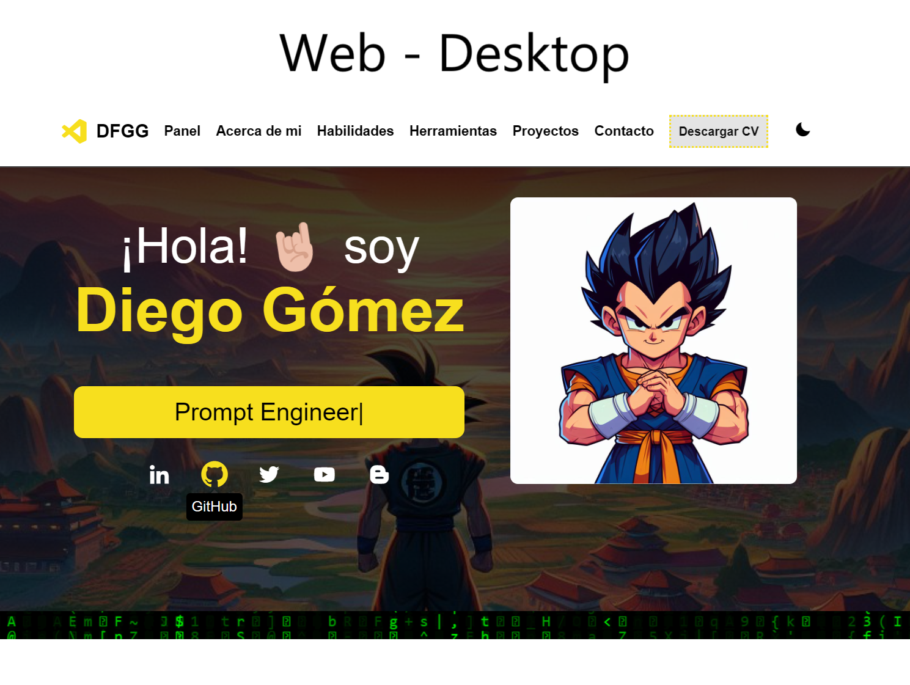
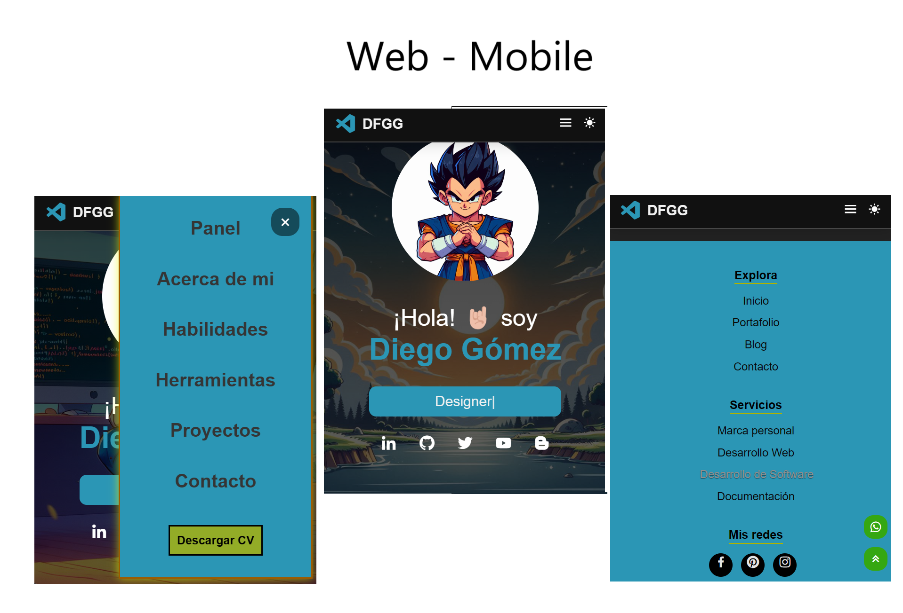

# Mi Portafolio
## _Desarrollado por Diego Gómez🤘🏼_

En este repositorio encontrarán mi portafolio personal, desarrollado con HTML, CSS y JavaScript.
De esta forma presento mis conocimientos a posibles reclutadores y clientes, mostrando la aplicación de diferentes tecnologías para el desarrollo de aplicaciónes Web con diseño responsive.

## Características
- **Creativo**: Este portafolio esta pensado en el animne de Dragon Ball Z, uno de mis preferidos, por lo tanto la página presenta una transformación de Super Saiyan representada de color amarillo y otra transformación llamada Super Saiyan Blue representada de color azul.
- **Interactividad**: El portafolio cuenta con elementos interactivos que se integran en diferentes espacios. Adicionalmente, cuenta con animaciones con transiciones temporizadas con el fin de generar un espacio agradable para el usuario al momento de navegar por ella. 
- **Diseño responsive**: El diseño del portafolio cuenta con adaptabilidad a los diferentes tipos de dispositivos, como los son computadoras, dispositivos móviles y hasta tablets.
- **División de portafolio**: Cuenta con secciones organizadas para establecer una estructura sencilla y conseguir navegabilidad desde la cabecera. Estas secciones son:
    - **Panel:** Presentación de secciones a las cuales acceder.
    - **Acerca de mi:** Información más relevante sobre mis gustos.
    - **Habilidades:** Aplicación de tecnologías para desarrollo web.
    - **Herramientas:** Otros software de soporte de mi trabajo.
    - **Proyectos:** Presentación de algunos proyectos que he realizado.
    - **Contacto:** Información para contactarme.
    - **Sección general sobre servicios:** Presentación general de algunos de los servicios que ofrezco.
- **Dark y Light Mode**: Todo el diseño responde a parámetros en modo oscuro y un modo claro con los que el usuario puede interactuar.
- **Descarga de Curriculum**: Es posible descargar mi curriculum personal den formato PDF dando click en el botón de "Descargar CV" que se encuentra en la sección de navegación.
- **Tecnologías utilizadas**:
    -  HTML
    -  CSS
    -  JavaScript
    -  Git
    -  GitHub
    -  Netlify

## Contribución
Te invito a que seas parte de mi portafolio contribuyendo con tus ideas. Si es así, es posible abrir un **issue** para discutir nuevas características o solucionar problemas. También podrías enviar un **pull request** con tu propuesta.

## Contacto
Si deseas conversar sobre mi portafolio o requieres algún tipo de consultoría, puedes contactarme a través de la información que aparece en **https://diego-felipe-gomez.netlify.app/#contact**.

## Agradecimientos
Gracias por visitar mi portafolio 💻. Disfruta de las diferentes transformasiones de Son Gokú. !Hasta una próxima oportunidad! 👋🏼

